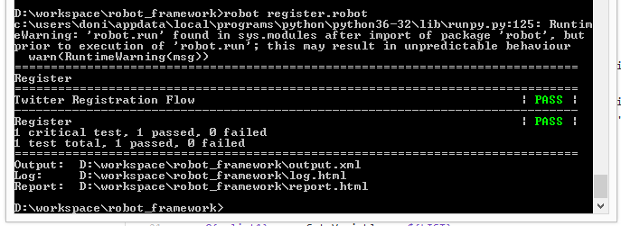

# letmetry-robot

## Requirements
1. pip install robotframework
2. pip install robotframework-selenium2library
3. pip install -U selenium
4. download geckodriver from [here](https://github.com/mozilla/geckodriver/releases), and set path to geckodriver.

## Run
$ robot register.robot

## Result

